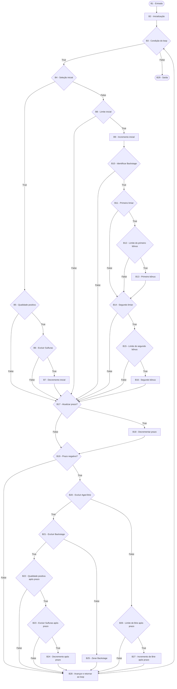

# Grafo de Fluxo de Controle - UpdateQuality

## 1. Método analisado

**Arquivo:** [gilded-rose-go/gildedrose/gildedrose.go](../../gilded-rose-go/gildedrose/gildedrose.go), linhas 8–58.

**Nome exato:** `UpdateQuality`, função do pacote `gildedrose` (sem receptor; tecnicamente não é um método Go).

**Assinatura:** `func UpdateQuality(items []*Item)`. A fonte de verdade é exclusivamente essa implementação de produção.

Este CFG deriva dos blocos da [análise estrutural](analise-estrutural.md), mantendo integralmente seus identificadores e sua granularidade.

## 2. Convenção dos nós

- B1: entrada; B29: saída normal.
- Retângulos: operações; losangos: decisões.
- B2: inicialização do índice; B3: condição do loop; B28: incremento e retorno.
- True e False indicam o resultado da expressão completa de cada decisão.
- Por convenção de modelagem adotada neste trabalho, cada expressão condicional completa do código-fonte representa uma única decisão estrutural no CFG. Assim, a expressão `A && B` de D2 corresponde a um único nó de decisão, B4. Seus predicados atômicos continuam documentados separadamente, junto com o comportamento de curto-circuito, na seção 5 da análise; eles não criam nós adicionais no CFG.
- Os títulos curtos remetem às expressões originais e linhas registradas na análise. Ramos `else` são arestas False, não decisões novas.
- O escopo é o fluxo normal, com referências de itens válidas. Falhas implícitas de runtime, como desreferência de elemento `nil`, não fazem parte das arestas abaixo.

Para o cálculo da Complexidade Ciclomática nas etapas seguintes, deve ser mantida exatamente essa granularidade, em consistência com o CFG já produzido: a condição composta com `&&` continuará contando como uma única decisão estrutural, e seus predicados internos não devem ser contados como decisões adicionais. Não se deve usar uma granularidade diferente no cálculo de V(G) sem antes reconstruir formalmente o CFG.

## 3. Lista de arestas

A lista inclui todas as transições do fluxo normal na granularidade adotada.

```text
B1 → B2
B2 → B3
B3 → B4 [True]
B3 → B29 [False]
B4 → B5 [True]
B4 → B8 [False]
B5 → B6 [True]
B5 → B17 [False]
B6 → B7 [True]
B6 → B17 [False]
B7 → B17
B8 → B9 [True]
B8 → B17 [False]
B9 → B10
B10 → B11 [True]
B10 → B17 [False]
B11 → B12 [True]
B11 → B14 [False]
B12 → B13 [True]
B12 → B14 [False]
B13 → B14
B14 → B15 [True]
B14 → B17 [False]
B15 → B16 [True]
B15 → B17 [False]
B16 → B17
B17 → B18 [True]
B17 → B19 [False]
B18 → B19
B19 → B20 [True]
B19 → B28 [False]
B20 → B21 [True]
B20 → B26 [False]
B21 → B22 [True]
B21 → B25 [False]
B22 → B23 [True]
B22 → B28 [False]
B23 → B24 [True]
B23 → B28 [False]
B24 → B28
B25 → B28
B26 → B27 [True]
B26 → B28 [False]
B27 → B28
B28 → B3
```

## 4. Grafo de Fluxo de Controle



## 5. Validação do CFG

Conferência cruzada com o corpo da função e a análise estrutural:

| Verificação | Resultado |
|-------------|-----------|
| Correspondência dos blocos | B1 a B29 aparecem uma vez como definição de nó, com os mesmos papéis da análise. |
| Correspondência das decisões | D1–D17 correspondem, em ordem, a B3, B4, B5, B6, B8, B10, B11, B12, B14, B15, B17, B19, B20, B21, B22, B23 e B26. |
| Ramos de decisões | Cada um desses nós possui uma aresta True e uma False, para os destinos da tabela de decisões. |
| Escritas de Quality | Linhas 14, 19, 23, 28, 44, 48 e 52 correspondem a B7, B9, B13, B16, B24, B25 e B27. |
| Escrita de SellIn | Linha 36 corresponde a B18. |
| Entrada e continuação do loop | B1 → B2 → B3; B3=True entra no corpo por B4. |
| Retorno do loop | Todos os ramos que terminam o corpo convergem em B28; B28 → B3 executa nova verificação. |
| Saída do loop | B3=False → B29, inclusive quando o slice não tem elementos. |
| Origens e destinos | Apenas B1 não tem predecessor e apenas B29 não tem sucessor; todos os outros nós possuem ambos. Todos os nós são estruturalmente alcançáveis a partir da entrada e têm conexão até a saída. |
| Lista e desenho | As arestas listadas e as arestas Mermaid possuem os mesmos destinos e rótulos, sem nós adicionais. |
| Fidelidade ao legado | Preservados os dois limiares sequenciais de Backstage, as guardas repetidas e a ordem de atualização de Quality/SellIn. Nenhum ramo foi criado para Conjured ou para expectativas dos testes. |

A alcançabilidade acima é uma propriedade das conexões do grafo, não uma afirmação de que toda combinação de resultados das condições seja viável para um mesmo item. Comparações repetidas e identidades de nome impõem relações entre decisões.

A única delimitação de modelagem que pode exigir revisão humana é a inclusão futura de fluxo excepcional para elementos `nil`; este documento explicita o escopo normal. A expressão composta permanece como um nó de decisão de fonte, com a avaliação interna documentada. Não foi identificada ambiguidade nos destinos dos ramos explícitos.

## 6. Complexidade Ciclomática

### 6.1 Pelos nós predicados

**V(G) = P + 1**

Os nós predicados são os 17 nós de decisão.

| Decisão | Nó | Decisão | Nó | Decisão | Nó |
|---------|----|---------|----|---------|----|
| D1 | B3 | D7 | B11 | D13 | B20 |
| D2 | B4 | D8 | B12 | D14 | B21 |
| D3 | B5 | D9 | B14 | D15 | B22 |
| D4 | B6 | D10 | B15 | D16 | B23 |
| D5 | B8 | D11 | B17 | D17 | B26 |
| D6 | B10 | D12 | B19 | | |

**V(G) = 17 + 1 = 18**

### 6.2 Por arestas e nós

**V(G) = E − N + 2**

- **N = 29**: nós B1 a B29.
- **E = 45**: arestas listadas na seção 3.

Conferência da quantidade de arestas pelo grau de saída de cada nó:

| Tipo de nó | Nós | Quantidade | Arestas de saída | Total |
|------------|-----|------------|------------------|-------|
| Decisão | B3, B4, B5, B6, B8, B10, B11, B12, B14, B15, B17, B19, B20, B21, B22, B23, B26 | 17 | 2 (True/False) | 34 |
| Sequencial | B1, B2, B7, B9, B13, B16, B18, B24, B25, B27, B28 | 11 | 1 | 11 |
| Saída | B29 | 1 | 0 | 0 |
| **Total** | | **29** | | **45** |

**V(G) = 45 − 29 + 2 = 18**

### 6.3 Resultado

| Fórmula | Cálculo | Resultado |
|---------|---------|-----------|
| P + 1 | 17 + 1 | 18 |
| E − N + 2 | 45 − 29 + 2 | 18 |

As duas fórmulas convergem: **V(G) = 18**. Esse é o número de caminhos linearmente independentes do CFG, ou seja, a quantidade mínima de caminhos de uma base para cobertura de caminhos básicos.

## 7. Caminhos independentes


| ID | Entrada | Caminho | Saída esperada |
|----|---------|---------|----------------|
| C1 | `[]` (slice vazio) | B1 → B2 → B3 → B29 | Nenhuma alteração |
| C2 | (Comum, 5, 10) | B1 → B2 → B3 → B4 → B5 → B6 → B7 → B17 → B18 → B19 → B28 → B3 → B29 | (4, 9) |
| C3 | (Comum, 5, 0) | B1 → B2 → B3 → B4 → B5 → B17 → B18 → B19 → B28 → B3 → B29 | (4, 0) |
| C4 | (Sulfuras, 5, 80) | B1 → B2 → B3 → B4 → B5 → B6 → B17 → B19 → B28 → B3 → B29 | (5, 80) |
| C5 | (Sulfuras, 5, 0) | B1 → B2 → B3 → B4 → B5 → B17 → B19 → B28 → B3 → B29 | (5, 0) |
| C6 | (Aged Brie, 5, 10) | B1 → B2 → B3 → B4 → B8 → B9 → B10 → B17 → B18 → B19 → B28 → B3 → B29 | (4, 11) |
| C7 | (Aged Brie, 5, 50) | B1 → B2 → B3 → B4 → B8 → B17 → B18 → B19 → B28 → B3 → B29 | (4, 50) |
| C8 | (Backstage, 15, 10) | B1 → B2 → B3 → B4 → B8 → B9 → B10 → B11 → B14 → B17 → B18 → B19 → B28 → B3 → B29 | (14, 11) |
| C9 | (Backstage, 8, 10) | B1 → B2 → B3 → B4 → B8 → B9 → B10 → B11 → B12 → B13 → B14 → B17 → B18 → B19 → B28 → B3 → B29 | (7, 12) |
| C10 | (Backstage, 8, 49) | B1 → B2 → B3 → B4 → B8 → B9 → B10 → B11 → B12 → B14 → B17 → B18 → B19 → B28 → B3 → B29 | (7, 50) |
| C11 | (Backstage, 3, 10) | B1 → B2 → B3 → B4 → B8 → B9 → B10 → B11 → B12 → B13 → B14 → B15 → B16 → B17 → B18 → B19 → B28 → B3 → B29 | (2, 13) |
| C12 | (Backstage, 3, 49) | B1 → B2 → B3 → B4 → B8 → B9 → B10 → B11 → B12 → B14 → B15 → B17 → B18 → B19 → B28 → B3 → B29 | (2, 50) |
| C13 | (Comum, 0, 10) | B1 → B2 → B3 → B4 → B5 → B6 → B7 → B17 → B18 → B19 → B20 → B21 → B22 → B23 → B24 → B28 → B3 → B29 | (-1, 8) |
| C14 | (Comum, 0, 1) | B1 → B2 → B3 → B4 → B5 → B6 → B7 → B17 → B18 → B19 → B20 → B21 → B22 → B28 → B3 → B29 | (-1, 0) |
| C15 | (Sulfuras, -1, 80) | B1 → B2 → B3 → B4 → B5 → B6 → B17 → B19 → B20 → B21 → B22 → B23 → B28 → B3 → B29 | (-1, 80) |
| C16 | (Backstage, 0, 10) | B1 → B2 → B3 → B4 → B8 → B9 → B10 → B11 → B12 → B13 → B14 → B15 → B16 → B17 → B18 → B19 → B20 → B21 → B25 → B28 → B3 → B29 | (-1, 0) |
| C17 | (Aged Brie, 0, 10) | B1 → B2 → B3 → B4 → B8 → B9 → B10 → B17 → B18 → B19 → B20 → B26 → B27 → B28 → B3 → B29 | (-1, 12) |
| C18 | (Aged Brie, 0, 49) | B1 → B2 → B3 → B4 → B8 → B9 → B10 → B17 → B18 → B19 → B20 → B26 → B28 → B3 → B29 | (-1, 50) |
