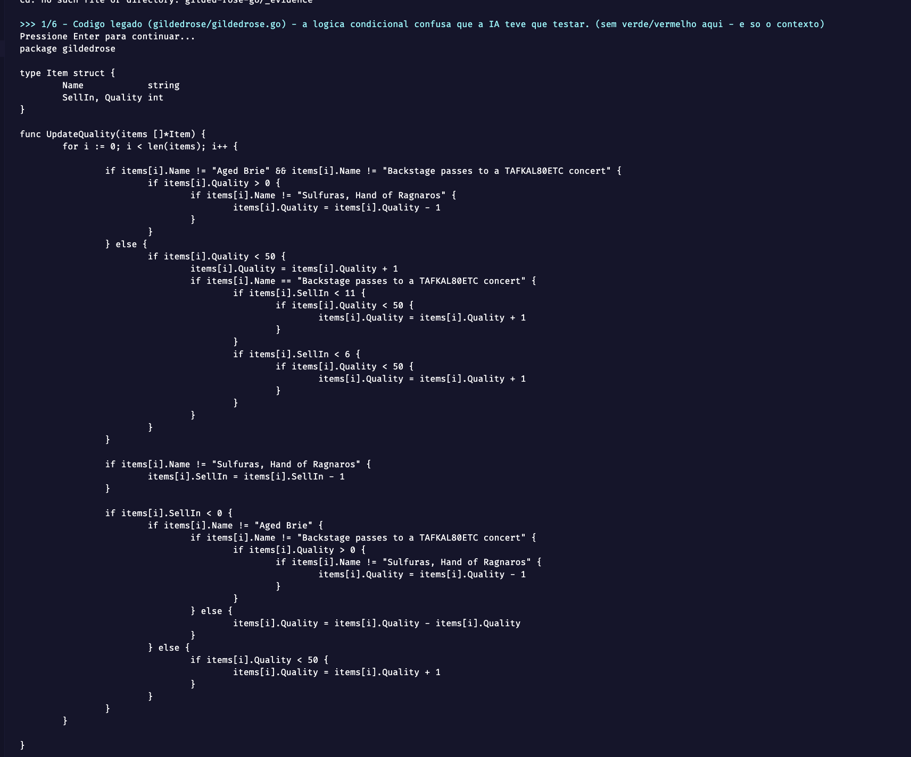
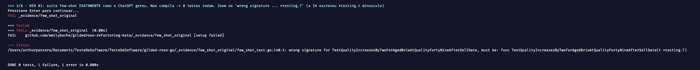
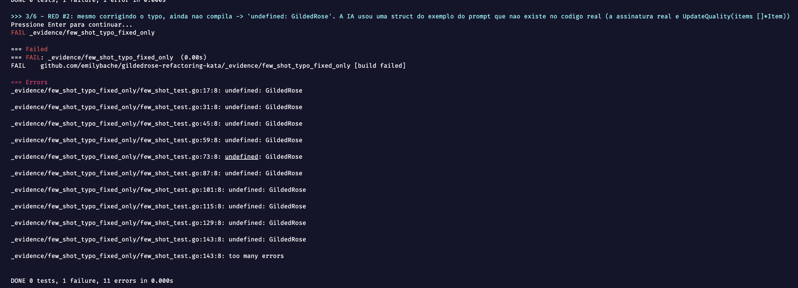
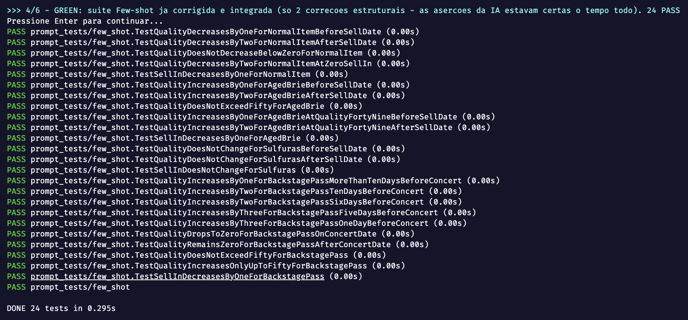
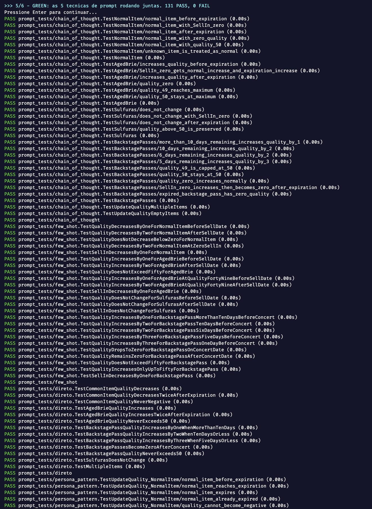
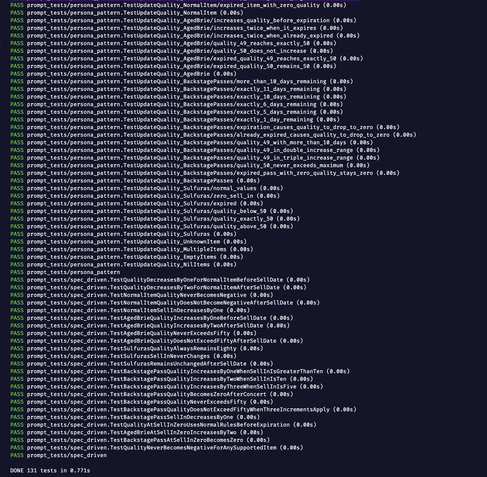
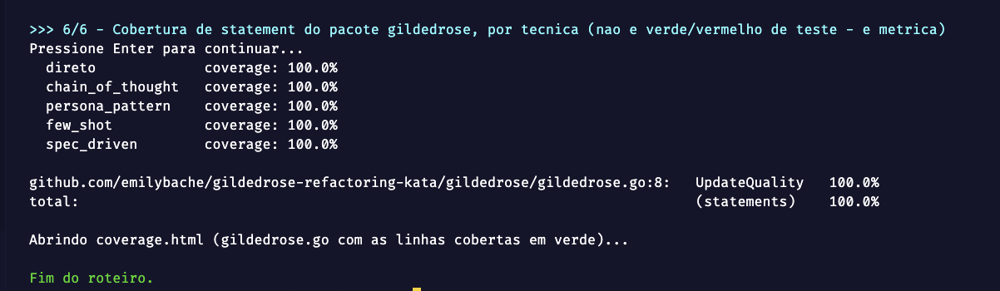
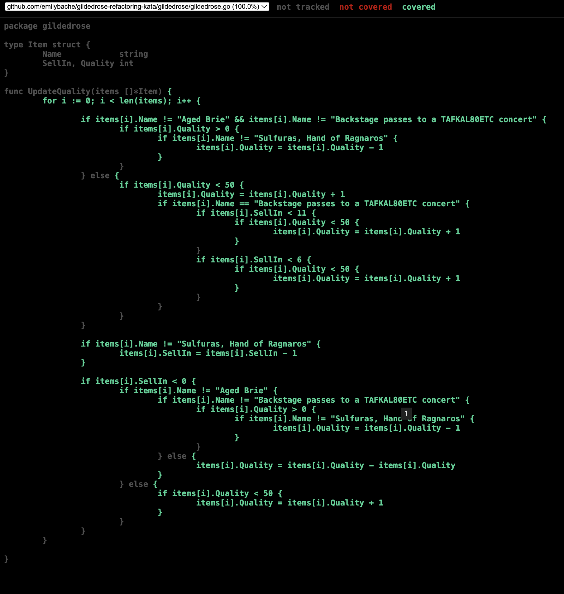

# Evidências visuais (Pessoa 4)

Esta pasta guarda as **evidências de execução** dos testes (terminal em vermelho/verde e
cobertura) para o vídeo e os slides. Nada aqui entra no build: o Go ignora por convenção
qualquer diretório que começa com `_`, então dá pra rodar `go test .` dentro das subpastas
sem afetar a suíte principal.

## O que tem aqui

| Arquivo/pasta | Para quê |
|---|---|
| `assets/Imagens/` | Os prints da execução dos testes (vermelho, verde e cobertura), prontos para os slides e o vídeo |
| `few_shot_original/` | Código do Few-shot como o ChatGPT gerou. Não compila (RED 1: typo `*testing.t`) |
| `few_shot_typo_fixed_only/` | Mesmo código só com o typo corrigido. Ainda não compila (RED 2: struct que não existe) |
| `coverage.out`, `coverage.html`, `coverage_summary.txt` | Cobertura gerada a partir de `prompt_tests/...` |

## Evidências capturadas

Rodado no macOS com `go1.25.5` e `gotestsum`, usando `-count=1` para não pegar cache. Os
prints estão em `assets/Imagens/`.

### 1. Código legado (`gildedrose.go`)

O `UpdateQuality` que a IA teve que testar. É só o contexto, não tem verde nem vermelho aqui.



### 2. RED 1: Few-shot como o ChatGPT gerou

Não compila, então nenhum teste roda. Aparece `FAIL` e `wrong signature ... must be: func
...(t *testing.T)`, porque a IA escreveu `*testing.t` minúsculo.



### 3. RED 2: mesmo corrigindo o typo, ainda não compila

Aparece `FAIL` e vários `undefined: GildedRose`. A IA usou uma struct do exemplo do prompt
que não existe no código real. A assinatura real é `UpdateQuality(items []*Item)`.



### 4. GREEN: Few-shot corrigido e integrado

Foram só duas correções estruturais. As asserções da IA já estavam certas. 24 testes passam.



### 5. GREEN: as 5 técnicas de prompt juntas

`DONE 131 tests`, nenhum `FAIL`.




### 6. Cobertura de statement: 100% nas 5 técnicas

Inclusive o prompt Direto, que é o mais simples.



### 7. Relatório visual de cobertura (`coverage.html`)

O `gildedrose.go` com todas as linhas verdes (cobertas) e o topo indicando 100%.



Ponto para o Veredito: até a suíte mais simples (prompt Direto) chega a 100% de cobertura de
statement. O `go tool cover` não mede se os valores de fronteira certos foram testados, então
100% coberto não quer dizer bem testado. O detalhe está em
[`../LOG-CORRECOES.md`](../LOG-CORRECOES.md).

## Como reproduzir os prints

```powershell
# RED 1
cd _evidence/few_shot_original
go test .

# RED 2
cd ../few_shot_typo_fixed_only
go test .

# GREEN com saída colorida por teste (requer gotestsum)
go install gotest.tools/gotestsum@latest
cd ../..
gotestsum --format testname -- ./prompt_tests/...

# Cobertura em HTML
go test ./prompt_tests/... -coverpkg=./gildedrose/... -coverprofile=_evidence/coverage.out
go tool cover -html=_evidence/coverage.out -o _evidence/coverage.html
```
